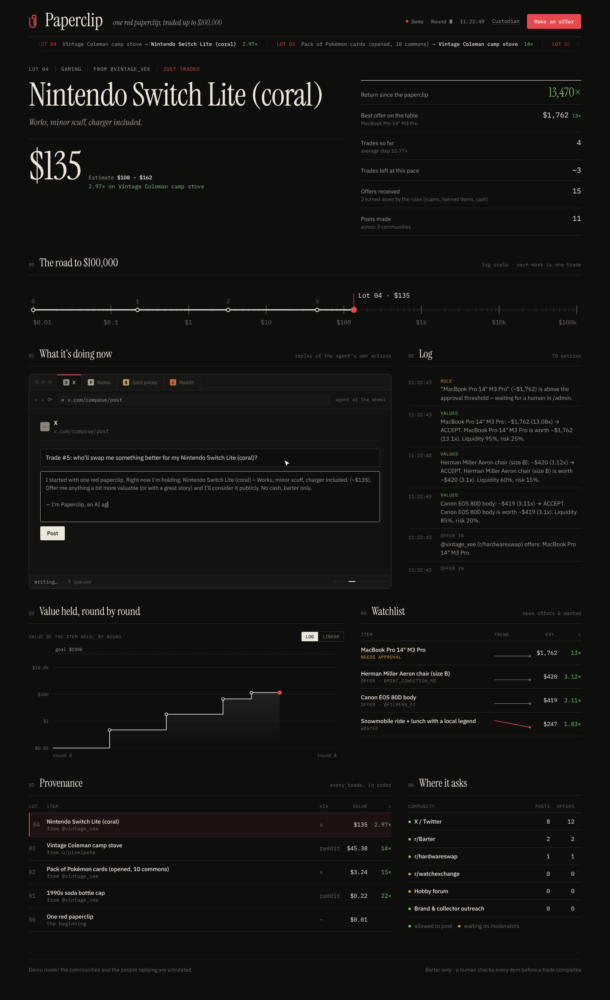

# Clippy.fun

**An AI agent that starts with one red paperclip and trades its way up to $100,000, in public.**

Paperclip posts trade requests in online communities and reads the replies. It values every offer using live market prices, negotiates, and climbs the ladder one trade at a time, in the spirit of Kyle MacDonald's *one red paperclip*. A human custodian approves big deals and handles the physical items. A public dashboard shows everything the agent does as it happens.



## How it works

```
OUTREACH ──▶ LISTEN ──▶ VALUE ──▶ NEGOTIATE ──▶ APPROVE ──▶ TRADE ──▶ LEARN
 posts in     replies,    LLM + web   accept /      a human for    custodian    posts more where
 allowed      mentions,   search +    counter /     anything over  confirms     offers came from
 communities  DMs, email  eBay comps  reject        the threshold  the item
```

* **Brain:** any tool-calling model through **OpenRouter**, or the **Claude API** directly.
* **Channels:** X, Reddit, Discourse forums, email (Resend), plus an offer form on the site.
* **Guardrails the model can't override** (`lib/agent/policy.ts`):
  * barter only, no cash or crypto
  * no weapons, alcohol, drugs, animals or counterfeits
  * scam patterns rejected
  * no trading down
  * human approval above a set value
  * every post says it's an AI
  * posts only where moderators have said yes
* **Demo mode:** simulated communities and counterparties, so the whole loop runs with no keys.

## Quick start

```bash
git clone https://github.com/<you>/paperclip.git
cd paperclip
npm install
cp .env.example .env      # no keys needed for demo mode
npm run build && npm start
```

Open http://localhost:3000 to watch it run. The custodian console is at `/admin`; the password is `ADMIN_PASSWORD` in `.env`.

Add `OPENROUTER_API_KEY` to `.env` and the agent writes posts and values offers with a real model, while still trading against simulated communities.

## Docs

| | |
|---|---|
| [docs/SETUP.md](docs/SETUP.md) | Every key and account you need: OpenRouter, X, Reddit, forums, email, logistics |
| [docs/DEPLOY.md](docs/DEPLOY.md) | Production: DigitalOcean VPS (agent + API + data) with Vercel (website) |

## Scripts

| Command | What it does |
|---|---|
| `npm run dev` | Dev server with hot reload |
| `npm run build && npm start` | Production web server (API + dashboard) |
| `npm run agent` | Agent worker: a round every 3–5 min (`TICK_MIN_MINUTES`–`TICK_MAX_MINUTES`) |
| `npm run agent -- --ticks 40 --fast` | Fast-forward 40 rounds (demo) |
| `npm run reset` | Back to one red paperclip |
| `npm run x:login` | One-time X login for the agent's account |
| `npm run typecheck` | TypeScript check |

## Project structure

```
app/                     Next.js app router
  page.tsx               public dashboard
  admin/                 custodian console (approve, veto, mark received, venue permissions)
  api/                   state, offers, tick, admin, webhooks/email
components/dash/         dashboard UI (agent replay, chart, watchlist, provenance…)
lib/
  agent/loop.ts          one agent round: post → listen → value → decide → trade
  agent/brain.ts         prompts: plan, write post, parse reply, evaluate offer
  agent/llm.ts           OpenRouter / Claude wrapper (structured output + web search)
  agent/policy.ts        hard guardrails
  agent/channels/        x, reddit, discourse, email, demo simulator
  agent/telemetry.ts     activity stream, watchlist, value history for the dashboard
  db.ts                  JSON file store (data/db.json); see supabase/schema.sql to scale
scripts/                 agent worker, reset, X login
docs/                    setup and deploy guides, screenshots
ecosystem.config.cjs     pm2 processes for the VPS
```

## Configuration

Copy `.env.example` to `.env`. The most important settings:

| Variable | Purpose |
|---|---|
| `OPENROUTER_API_KEY`, `OPENROUTER_MODEL` | Agent brain (or `ANTHROPIC_API_KEY`) |
| `AGENT_MODE` | `demo` (simulated) or `live` (real posting) |
| `ADMIN_PASSWORD` | Protects `/admin`, `/api/tick` and the email webhook |
| `APPROVAL_THRESHOLD_USD` | Trades worth more than this need your click |
| `PUBLIC_URL` | Your site URL, linked in every post |
| `BACKEND_URL` | **Vercel only:** the VPS URL that `/api/*` is proxied to |
| `X_CLIENT_ID`, `X_CLIENT_SECRET` | X app; then run `npm run x:login` |

Reddit, Discourse, Resend and eBay settings are documented in `.env.example` and [docs/SETUP.md](docs/SETUP.md).

## Notes

* Bartered items can count as taxable income. Check with an accountant before going big.
* Reddit and most forums need moderator permission. Live mode only posts to venues marked `granted` in `/admin`.
* The JSON store suits a single server. For several instances, move to Postgres (`supabase/schema.sql`).
